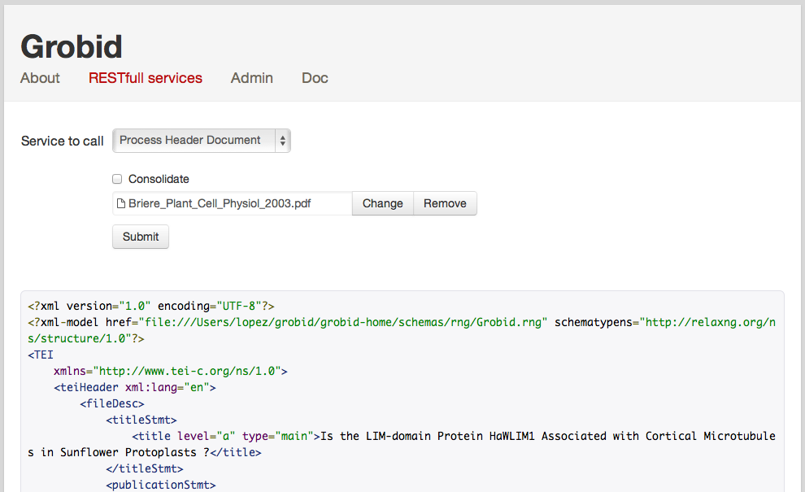

<h1>GROBID service</h1>

The GROBID RESTful API provides a simple and efficient way to use the tool. A service console is available to test GROBID in a human friendly manner. For production and benchmarking, we recommand to use this web service mode on a multi-core machine.  

## Start the server
Go under the `grobid/grobid-service` directory:
```bash
> cd grobid-service
```
The following command will start the server on port 8080:
```bash
> mvn jetty:run-war
```
To skip the tests:
```bash
> mvn -Dmaven.test.skip=true jetty:run-war
```

You can check whether the service is up and running by opening the following URL: 
 - `http://yourhost:8080/version` will return you the current version
 - `http://yourhose:8080/isalive` will return true/false whether the service is up and running

## Use GROBID

On your browser, the welcome page of the Service console is available at the URL `http://localhost:8080`

The RESTful API can be tested under `Services`:



You can also test the RESTFul API with **curl** command lines: 

* header extraction of a PDF file in the current directory:
```bash
> curl -v --form input=@./thefile.pdf localhost:8080/processHeaderDocument
```
* fulltext extraction (header, body and citations) of a PDF file in the current directory:
```bash
> curl -v --form input=@./thefile.pdf localhost:8080/processFulltextDocument
```
* parsing of a raw reference string in isolation without consolidation (default value):
```bash
> curl -X POST -d "citations=Graff, Expert. Opin. Ther. Targets (2002) 6(1): 103-113" localhost:8080/processCitation
```
* extraction and parsing of all references in a PDF without consolidation (default value):
```bash
> curl -v --form input=@./thefile.pdf localhost:8080/processReferences
```

## Full documentation

Grobid REST services are documented in the following document: [grobid-service/src/main/doc/grobid-service_manual.pdf](https://github.com/kermitt2/grobid/blob/master/grobid-service/src/main/doc/grobid-service-manual.pdf)

The documentation covers in details the administrative API, the usage of the web console, the extraction and parsing API and gives some examples of usages with `curl` command lines. 


## Configuration of the password for the service adminstration

A password is required to access the administration page. The default password for the administration console is **admin**.

For security, the password is saved as SHA1 hash in the file `grobid-home/config/grobid_service.properties` with the property name `org.grobid.service.admin.pw`

To change the password, you can replace this property value by the SHA1 hash generated for your new password of choice. To generate the SHA1 from any `<input_string>`, you can use the corresponding Grobid REST service available at:

> http://localhost:8080/sha1?sha1=`<input_string>`


## Parallel mode

The Grobid RESTful API provides a very efficient way to use the library out of the box, because the service exploits multithreading.

The service can work following two modes:

+ Parallel execution (default): a pool of threads is used to process requests in parallel. The following property must be set to true in the file grobid-home/config/grobid_service.properties

```java
	org.grobid.service.is.parallel.execution=true
```

As Grobid is thread safe and manages a pool of parser instances, it is also possible to use several threads to call the REST service. This improves considerably the performance of the services for PDF processing because documents can be processed while other are uploaded. 

+ Sequencial execution: a single Grobid instance is used and process the requests as a queue. The following property must be set to false in the file grobid-home/config/grobid_service.properties

```java
	org.grobid.service.is.parallel.execution=false
```

This mode is adapted for server running with a low amount of RAM, for instance less than 2GB. 


