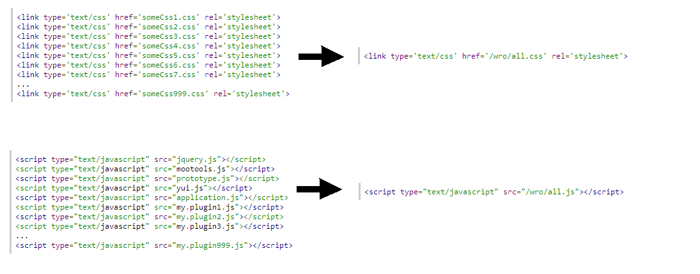

# summary 
A brief introduction and describes the purpose of the project

There are countless articles related to *web performance*. The most comprehensive one is performed by researchers from Yahoo. They have identified a number of best practices for making web pages fast. You can find the details [here](http://developer.yahoo.com/performance/rules.html). They have created a tool called [YSlow](http://developer.yahoo.com/yslow/): which analyzes web pages and tells you why they're slow based on the rules for high performance web sites. YSlow is a Firefox add-on integrated with the popular Firebug web development tool. 

The aim of _wro4j_ project is to help application developed on java platform to address a couple of those problems described by Yahoo research. More, exactly it is about *"Minimize HTTP Requests"* and *"Gzip Components"*.

It is common knowledge that it is faster to serve one large file rather than two smaller ones, because of increased HTTP negotiation and the fact that most browsers only keep two connections open to the same host at any given time. The purpose of *wro4j* project is to reduce the number of requests needed to load a page and the amount of data to transfer to clients, achieving drastic improvement of loading times. The resources can be benefit also from minification and compression.

The main reason this project was born, is because the java community doesn't have too many options when it comes to choosing between this kind of frameworks. There are few similar projects: [Jawr](https://jawr.dev.java.net/), [JSO](http://js-optimizer.sourceforge.net/)... but each of them has some kind of limitations or dependencies issues, no recent activity, etc... Also, I believe that competition is good and any framework brings something new you can learn from. 

The image below, resume the main purpose of why you should use wro4j. 

